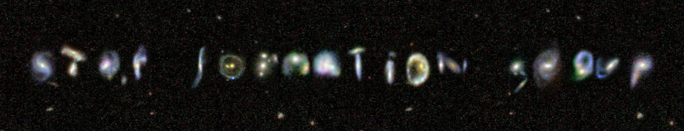

<!-- MathJax configuration -->

I'm Feiyu Quan (全飞宇), a PhD student at The Chinese University of Hong Kong [Star Formation Group](https://www.phy.cuhk.edu.hk/sfg/) studying astrophysics. Previously, I studied astrophysics at University of Toronto and University of Cambridge.

## My research

**F. Quan** et al., Interpreting Polarization Measurements in the Orion Clouds with Sub-Alfvénic MHD Simulations, in prep.

Interactive visualizations of dense cores in molecular clouds and their surrounding magnetic fields (from our own simulation results) can be found at [here (misaligned magnetic fields)](assets/visualizations/clump2.html) and [here (aligned magnetic fields)](assets/visualizations/clump4.html). (They could take a while to load. If they are not loading, clearing your browser's cache might help.)

In these visualizations, the red field lines indicate that they pass through dense regions with volume density \( > 5 \times 10^4 \ {\rm H_2}\ \mathrm{cm}^{-3} \) , while the blue field lines pass through diffuse gas with smaller volume density. The grey-scale color indicates different volume density.

## Curriculum vitae

[Click here to download my CV as a PDF file](CV.pdf)

## Contact

Email: <feiyu.quan@link.cuhk.edu.hk>  

[My LinkedIn](https://www.linkedin.com/in/feiyu-quan-158002190/)
